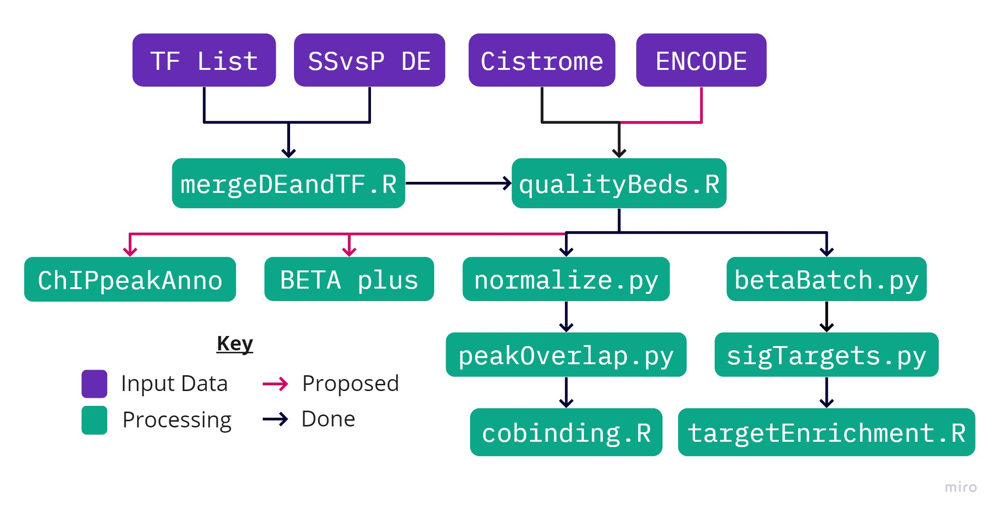

# TFs and Quiescence
Some very messy, commentless code that I created to play around with ChIP-Seq Data

## Table of Contents
1. [Overview](#Overview)
2. [betaBatch.py](#betaBatch.py)
2. [cobinding.R](#cobinding.R)
4. [deTargets.R](#deTargets.R)
5. [mergeDEandTF.R](#mergeDEandTF.R)
6. [normalize.py](#normalize.py)
7. [peakOverlap.py](#peakOverlap.py)
8. [pullPeakFiles.py](#pullPeakFiles.py)
9. [sigTargets.py](#sigTargets.py)
10. [targetEnrichment.R](#targetEnrichment.R)

## [Overview](https://miro.com/app/board/o9J_kmhzx0k=/?moveToWidget=3074457349492140638&cot=12)

## [betaBatch.py](betaBatch.py)
**Dependencies:** Python 2.7, [futures](https://pypi.org/project/futures/), and [BETA](http://cistrome.org/BETA/)

Runs BETA minus (hg38) on input bed files to generate list of potential targets ranked by regulatory potential as it is defined in [PMC4135175](https://www.ncbi.nlm.nih.gov/pmc/articles/PMC4135175/).

## [cobinding.R](cobinding.R)
_**Note:** Designed to run as job array on Hoffman2 Cluster_

**Dependencies:** R 4.0+, tideverse, pheatmap, dendsort, RColorBrewer, fastcluster

For each top or bottom ranked TF by enrichment with quiescence, this creates dataframes combining all associated [rank normalized](#normalize.py), [peak overlapped](#peakOverlap.py) bed files. Then, after clustering both rows and columns with Euclidean distance and Ward linkage using the incredibly memory efficient [fastcluster](http://danifold.net/fastcluster.html) library, it creates cobinding heatmaps as seen in [PMC4154057](https://www.ncbi.nlm.nih.gov/pmc/articles/PMC4154057/).

## [deTargets.R](deTargets.R)
**Dependencies:** R 4.0+ and tidyverse

Inner join each [consolidated targets file](#sigTargets.py) with the differential expression data.

## [mergeDEandTF.R](mergeDEandTF.R)
**Dependencies:** R 4.0+ and tidyverse

Performs an inner join between a [list of human transcription factors](http://humantfs.ccbr.utoronto.ca/download.php) and differential expression data generated using DESeq2. Sorts the resulting dataframe by ascending log2 fold change and removes any rows with:  
>`abs(log2FoldChange)<1.0 | padj>0.05`

## [normalize.py](normalize.py)
**Dependencies:** Python 3.8+, tqdm, and pandas

Reads bed files, ranks peaks*, and assigns them each a normalized rank score equal to `(R-r)/(R-1)`, where `r` is the rank of each peak in the total set of `R` peaks. Output files only keep the chromosome, peak start, peak end, and normalized rank columns.

* Peaks are ranked by descending signal value (enrichment) when the variable `rankBy == 6` and ranked by ascending q value (p-adjusted) when `rankBy == 8`.

## [peakOverlap.py](peakOverlap.py)
**Dependencies:** Python 3.8+, tqdm, pandas, and bedtools

For each transcription factor, runs all unique combinations of:
>`bedtools intersect -a {factor} -b {cofactor} -loj` 

`factor` is always the TF's [highest quality](qualityBeds.R), [rank normalized](#normalize.py) bed file.  
`cofactor` can be any other TF's highest quality, rank normalized bed file.

For each unique combination of `factor` and `cofactor`, each row in the output file combines the chromosome, peak start, and peak end values from `factor` with the normalized rank of the overlapping peaks in `cofactor` (-1 if none; multiple rows if more than one).

## [pullPeakFiles.py](pullPeakFiles.py)
**Dependencies:** Python 3.8+ and pandas

For each transcription factor that exhibits [significant differential expression](#mergeDEandTF.R), reads [Cistrome ChIP-Seq](http://cistrome.org/db) index file to copy TF-associated narrowPeak bed files to a new directory with the following structure:
>`~/peaks/{factor}/*.bed`

## [qualityBeds.R](qualityBeds.R)
**Dependencies:** R 4.0+ and tidyverse

Uses a mix of [ENCODE](https://www.encodeproject.org/data-standards/terms/) and [Cistrome](http://cistrome.org/db/#/about) ChIP-Seq quality guidelines to filter and rank the quality of all bed files in a new directory with the following structure:
>`~/goodBeds/{factor}/{rank}.bed`

Specifically, bed files have to meet the following criteria:
>`fastQC>=25 && UniquelyMappedRatio>=0.5 && PBC>=0.5 && PeaksUnionDHSRatio>=0.7`

The passing files were then sorted first by descending `FRiP` then by descending `PeaksFoldChangeAbove10` before being assigned their final ranks.

## [sigTargets.py](sigTargets.py)
**Dependencies:** Python 3.8+ and pandas

For each transcription factor, consolidates all BETA output files into a single tab-delimited csv file with all lower scoring duplicate targets dropped.

## [targetEnrichment.R](targetEnrichment.R)
In Progress